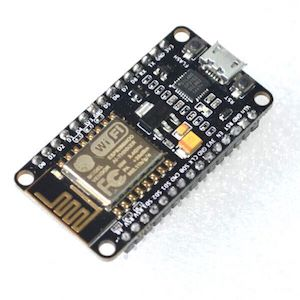

So... Here's a problem that most CMU students encounter on a daily basis: finding someplace to study. This process is surprisingly labor intensive: Here's an example:

  1. You decided to find some place to study.
  2. You walk to Sorrells Library in Wean, and it was full: after the recent renovation the library has become one of the best places to study on campus, and there was no spot left.
  3. You walk to Hunt Library, climb to the 3rd floor, and it was also full. You think that Gates may have some spots left and walk to Gates...

... and you just traversed half of the campus, wasting 15 minutes for no good reason. (Or, if you are one of the glass-half-full kind of person, it's 15 minutes of workout.) What if there exists a web page so people can check if a library is full or not...

The basic idea here is to estimate occupancy in a cheap and reliable way. Some ways are:

  1. Installing an IR sensor at the door of the library, and count people entering/exiting the library.
  2. Putting a camera at the door of the library, and count people entering/exiting the library.
  3. Putting cameras in the library, and count people currently in the library.
  4. Using some device to count Wi-Fi devices in the library, and estimate occupancy based on Wi-Fi devices.

The problem with 1 and 2 is that both solutions are counting delta/difference. We need to integrate the difference to get an occupancy estimation, and error will accumulate over time. 2 and 3 both require cameras: although cameras themselves are cheap, and computer vision libraries for recognizing people exist, hardware able to process camera input is expensive. Cameras may also raise concerns about privacy: most people are not comfortable if they are "monitored". The only cheap and reliable way is 4: using some gadget to count Wi-Fi devices.

And that gadget is ESP8266. A Wi-Fi-enabled SoC. There are a lot of boards with this chip out there on eBay. The one I used to develop the system is this one:

And these boards are _very_ cheap (4-8 dollars a piece).

To investigate if this is going to work, I modified some code ([Github](https://github.com/kalanda/esp8266-sniffer)) found online and see if it is going to pick up any device. 

The code listens for probe request frames (broadcast frames from Wi-Fi enabled devices to check what access points are available nearby). I flashed the program into the ESP8266, and it worked! The problem is: there are too many probe requests...

To be continued.
