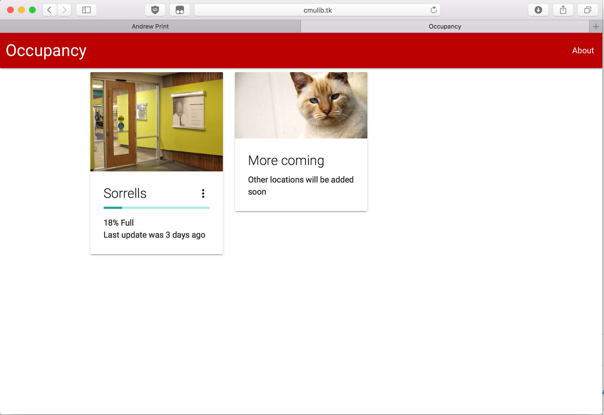
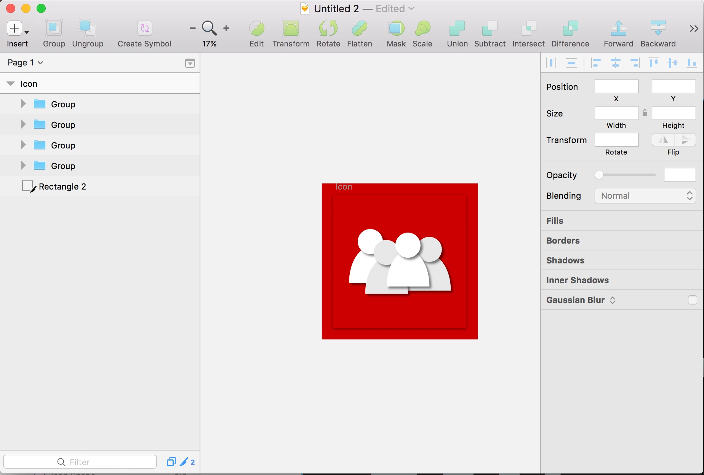
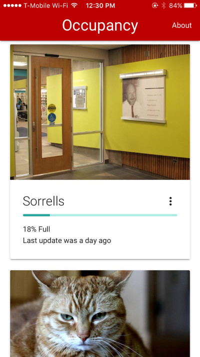
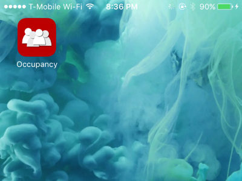

The only part missing was a front-end. It is 2017, and splitting up front-end and back-end is now a must. 
This is even more true in this project: serving html and other resources from my free Heroku server does not sound like a good plan - with only 1 web instance, the server can be easily saturated. So the plan was to host the front-end on GitHub.

The frameworks I chose for this job is [Vue](https://vuejs.org/) for [MVVM](https://en.wikipedia.org/wiki/Model–view–viewmodel) and [MaterializeCSS](http://materializecss.com) for the appearance. The reason for using Vue instead of React and Angular was Vue is more suited for small project like this, and is extremely easy to setup (include a js file, add 5 lines of code and Vue is ready). The reason for using MaterializeCSS was simply because it looks nice.

A few hours later: 

The front-end is pretty bare-bones (< 100 SLOC of js), but it does the job. And thanks to MaterializeCSS, it doesn't look half bad. The page is also responsive (again, thank you MaterializeCSS).

The front-end already looks pretty nice on phones, so I took a step further to make it an iOS Web App (no I don't want to pay $99/year to make it an actual iOS App).

The first thing to do when developing a mobile app is of course to design an app icon.

It won't get me any design award but hey, it's an icon.

The tricky part of making the iOS Web App is trying to make it act like a native app. Some CSS magic was used to make it app-like. Also I spend I lot of time working around an iOS bug that made the entire html scroll and bounce even if I told it not to... A few failed attempts later I gave in and used a library called iNoBounce. That worked well.

How the icon looks on home screen:

Good enough.

[Frontend Code on GitHub](https://github.com/gyf304/occupancy-frontend)
