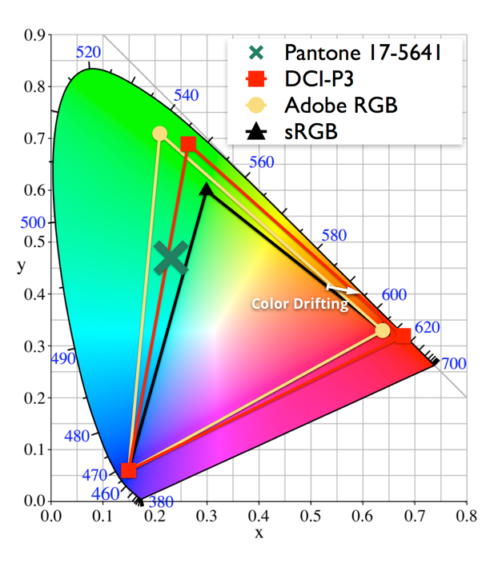
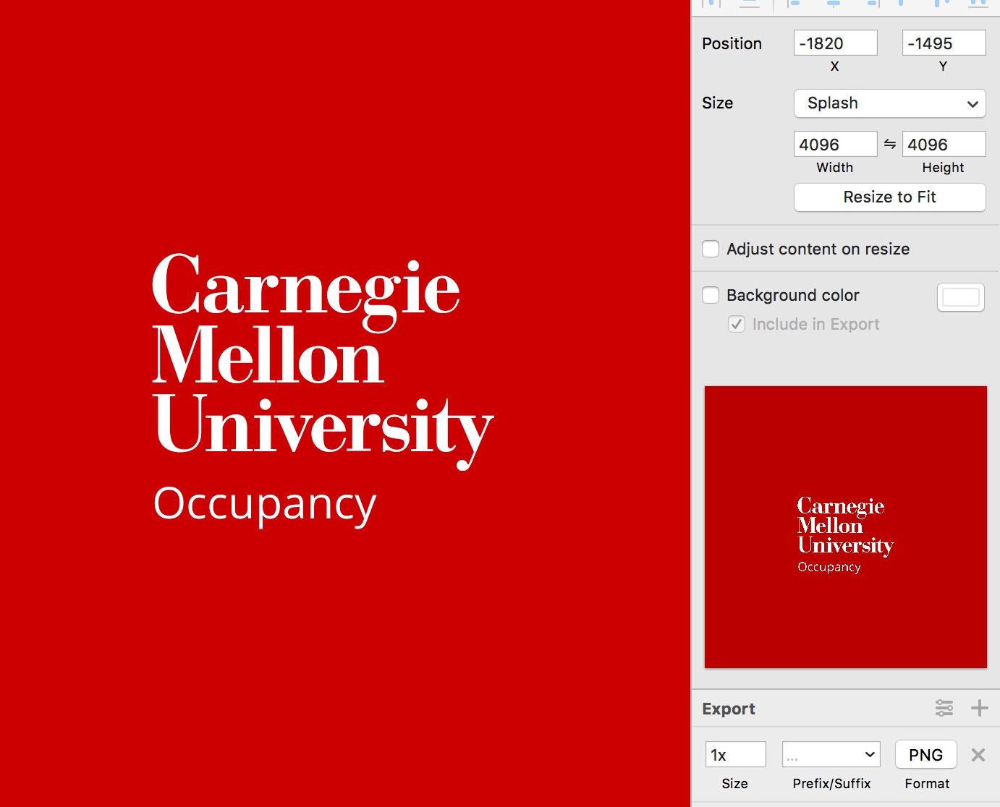

Color management is something trivial but important. This was previously only important for graphic designers / photographers who need their displays to accurately represent colors and do soft-proofs correctly. Things have changed.

Why this has never been a problem before? The answer is a color profile called sRGB, standard Red Green Blue, defined by HP and Microsoft for screens, printers and Web in 1996.  Most consumer electronics use sRGB: Monitors are either pre-calibrated with sRGB or have a sRGB mode built-in; smartphones, including iPhones, uses sRGB (iPhone 7 supports a wider gamut DCI-P3, but uses sRGB by default), etc. sRGB is 20 years old. During the 20 years, CPU frequency has jumped from 150MHz to 4GHz, internet speed has increased from 56Kbps to 1Gbps, and new monitor technologies like plasma, LCD, OLED were put into wide use. Professional grade high gamut monitors are increasingly common these days. For example, I'm using a late-2016 MacBook Pro. Since that generation all MacBook Pros uses DCI-P3 gamut, a much wider gamut than sRGB, the previous de-facto industry standard. 

However, there's a "legacy" problem: since sRGB is still the most common color gamut in the market, some (actually, most) applications assumes everyone uses sRGB and do no color management. This results in weird color renderings.

For example, the CMU logo has RGB values of (187,0,0) in sRGB. When an application without color management support tries to display that on my DCI-P3 screen, it uses the RGB values (187,0,0), but displays it in DCI-P3 instead of sRGB. This results in a much redder color, since DCI-P3 allows a higher saturation of red.

This is a graph illustrating the color drift when not correctly doing the sRGB -> DCI-P3 mapping. Although the difference on the graph is small, the difference is perceivable when displayed.

Here's an example of Sketch App, which doesn't do color management. Strangely, its preview window is rendered in sRGB while the main window is rendered in native screen color space (DCI-P3):

(Color Profile is stripped so the difference is visible regardless of your monitor gamut.)

It is quite astonishing to see a widely used design tool not using color management. This oversight will most likely cause confusion in a collaborating environment when people are using different monitors with different color spaces. Also if people designing for Web (which uses sRGB) are using a wide-gamut display for Sketch, they will find the actual web page is less vivid than what they see in Sketch.

However, most graphics / photo applications do support color management, including GIMP and Photoshop.

On the consumer side: some web browsers don't do color management  or don't do it in a standard conforming way: Chrome doesn't do color management correctly unless you set the flag `enable-color-correct-rendering`. 
Safari on Mac, on the other hand, supports color management correctly by default.

Here's a short list of applications I use and how these do color management.

  1. Sketch: No color management, developers claim it's a design decision. (???)
  2. GIMP: Color management can be enabled.
  3. Krita: Color management enabled by default.
  4. Photoshop: Color management enabled by default.
  5. Chrome: Color management enabled by default but not standard conforming. Correct color management if `enable-color-correct-rendering` flag is set.
  6. Safari: Color management enabled by default.
  7. Preview on Mac: Color management enabled.
