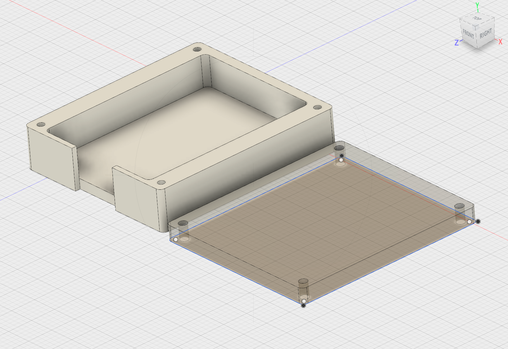
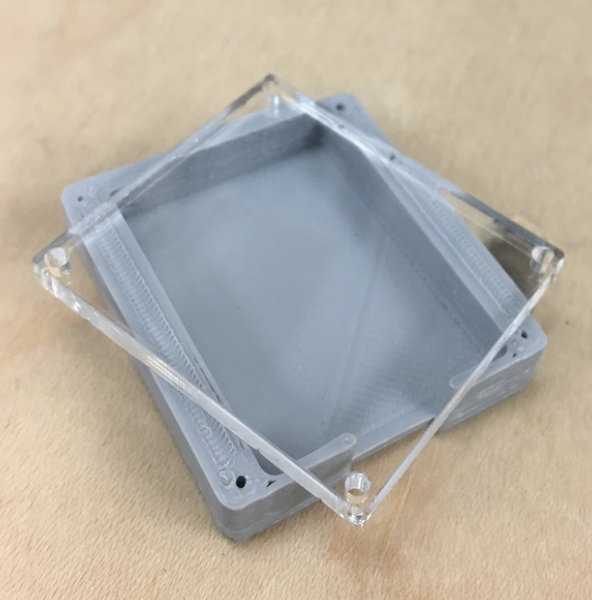
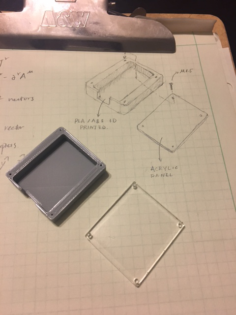

It's almost time to deploy the ESP8266s. I switched from the previous board to wemos mini lite, a smaller board with a variant of ESP8266 (ESP8285). The ESP8285 includes a on-chip 1M EEPROM, reducing the cost. The most important difference is that the newer boards don't have pre-soldered pin headers. Desoldering pins from the previous board is proven to be tedious and time-consuming.

While waiting for the boards being shipped from China to me, I designed a enclosure for that board. I can, of course, just stick the boards to walls. But a case is always nice - it makes the project look less cheap (while it actually is pretty cheap).

The design is consisted of 2 parts: the body and the cap. The body is going to be 3D printed while the cap is going to be cut from clear acrylic panel. 4 M1.5 screws hold the components together.

The parts are modeled with Autodesk Fusion 360...

and then made...

and compared to my sketch...

