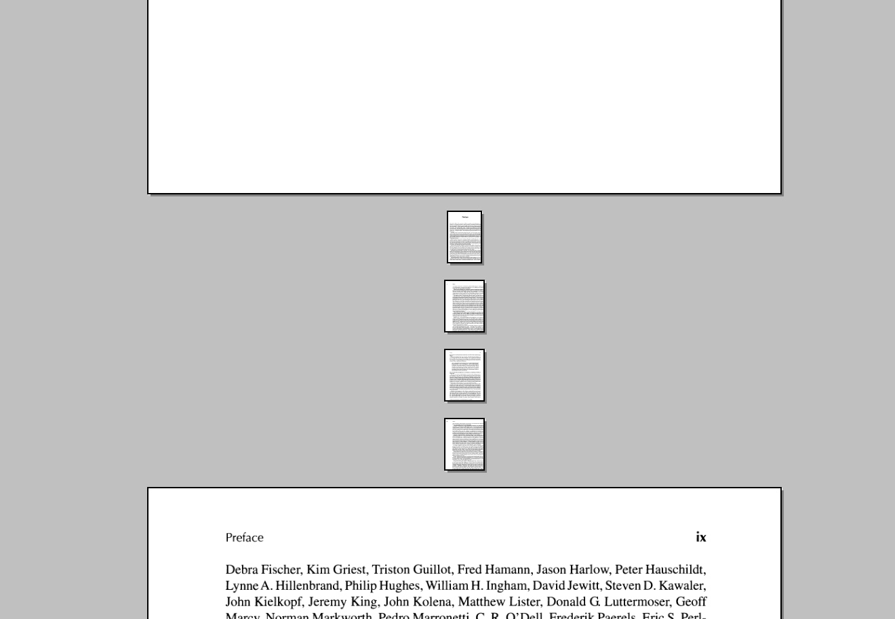
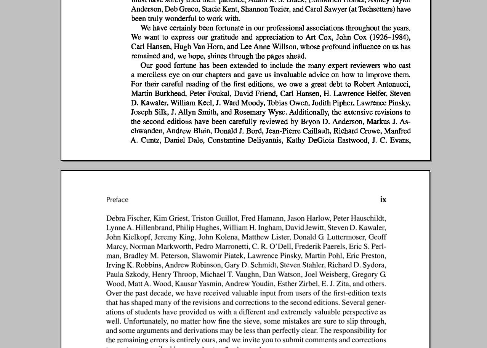

There are a lot of scanned books in the DjVu format, but many of them are not professionally scanned. One of the DjVu books I encounter has different page sizes (page size changes every few pages). There are nice pdf scaling programs, but no such program for DjVu exists.

So I made my own. The python 3 program searches for INFO blocks which specify sizes and DPIs of images and change DPIs to match a constant width. The program needs improvement though - it currently reads the entire file into memory for processing. However, this is not a problem for my files so I'm not going to change it.

[DjVu Specification](https://www.cuminas.jp/docs/techinfo/DjVu3Spec.pdf)

```
# usage: python3 djvu.py [FILE] [PAGE_WIDTH(IN)]
import sys
import struct

def main():
    args = sys.argv
    if len(args) != 3:
        print('filename? page_width?')
        return
    filename = args[1]
    page_width = float(args[2])
    file_bytearray = None
    with open(filename, mode='rb') as f:
        file_bytearray = bytearray(f.read())
    for i in range(len(file_bytearray) - 8):
        if file_bytearray[i:i+7] == b'INFO\0\0\0':
            info_start = i+8
            (width, height) = struct.unpack('>HH', file_bytearray[info_start:info_start+4])
            desired_dpi = int(width / page_width)
            file_bytearray[info_start+6:info_start+8] = struct.pack('<H', desired_dpi)
    with open(filename+'mod.djvu', mode='wb') as f:
        f.write(file_bytearray)

if __name__ == '__main__':
    main()
```

Before



After

