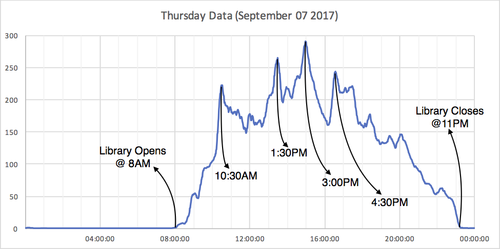
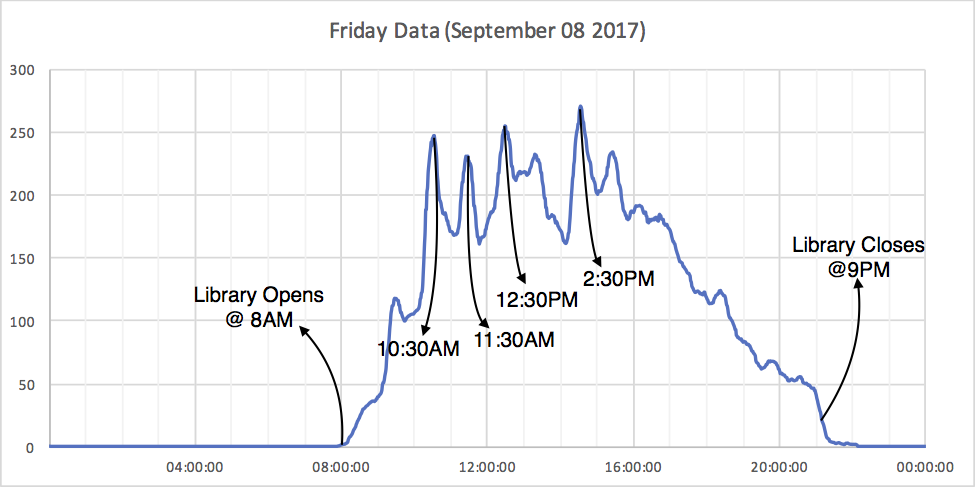
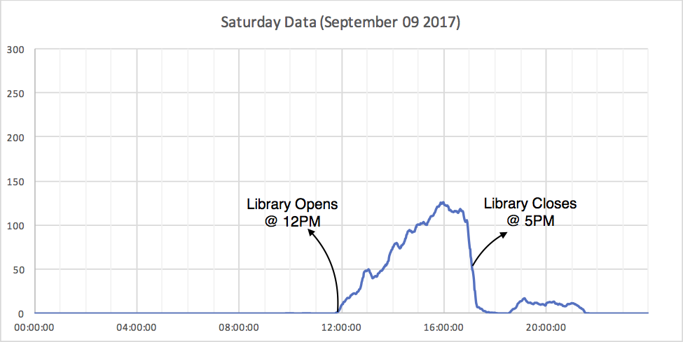
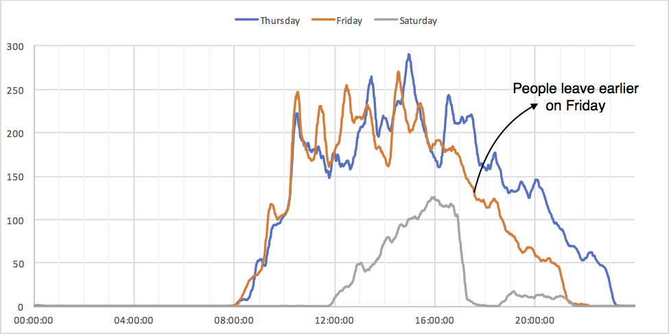

The occupancy project is now deployed at Sorrells Library. After running for more than a week, it's time to see how it performs...

So I dumped the database, feed the dump into a python script for processing, and plotted occupancy for each day. And the results are surprisingly good! Let's take a look.

Here is occupancy plotted vs. time of the day. We are able to see multiple peaks that sometimes exceeds total capacity of the library. It may sounds strange but there is a scientific explanation. The system detects Wi-Fi devices (and therefore occupancy) present in the last ~3 minutes. So if there are a lot of people moving in and out of the library, the estimated occupancy will increase rapidly, since the system counts everyone in the library during that time, even if the person is leaving / entering the library. 

As explained above, large flows of people are shown on graphs as peaks. I marked the most identifiable ones.

Not surprisingly, the peaks coincide start/end times of popular courses. Here's occupancy data on Saturday for comparison.

Now if we merge these together...

