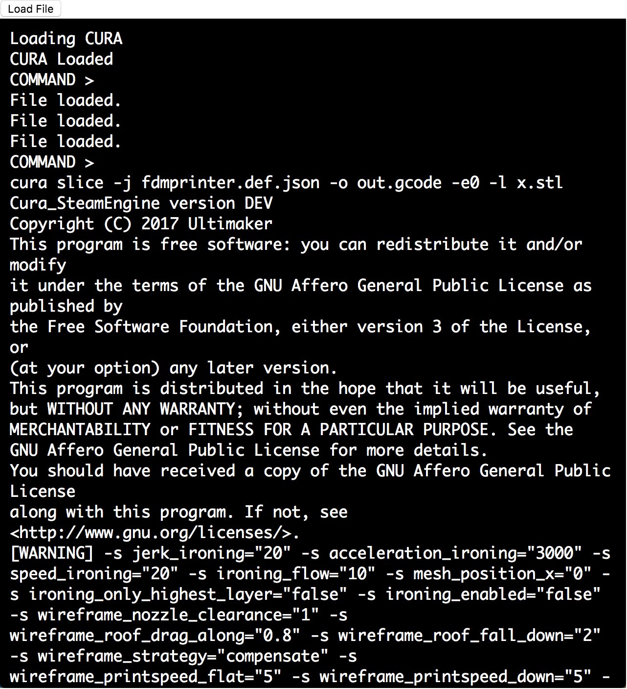

I just ported CuraEngine to browser using Emscripten.

[Linky](http://yifangu.com/cura-emscripten/)

You will be greeted by a terminal emulator which supports a very minimal set of instructions [cd, ls, pwd, rm, rmdir, cura, download].

After loading necessary files using the load button above, you can use CuraEngine just like normal. 

After you're done with everything. Issue a `download <your-file>` command to download the generated gcode.

Note that the VM has only 64MB of memory which is shared between the runtime and the filesystem.

